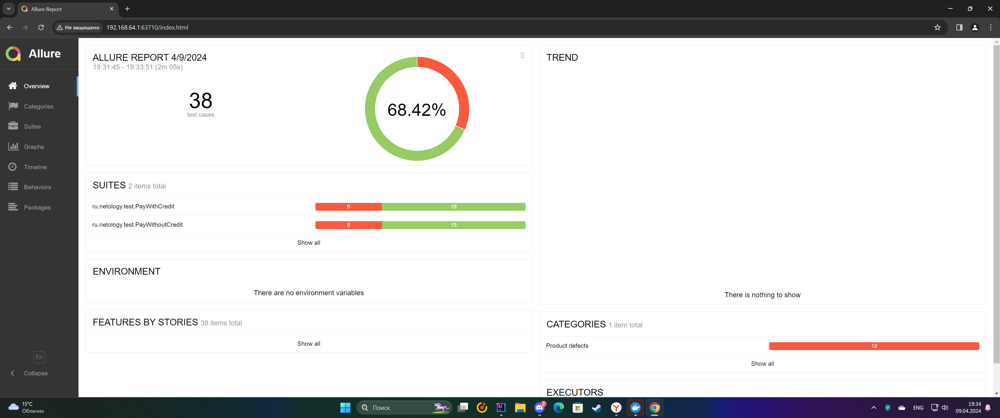
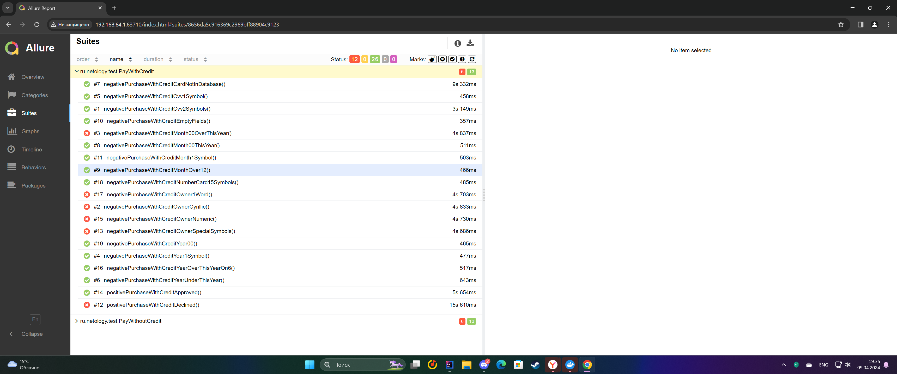
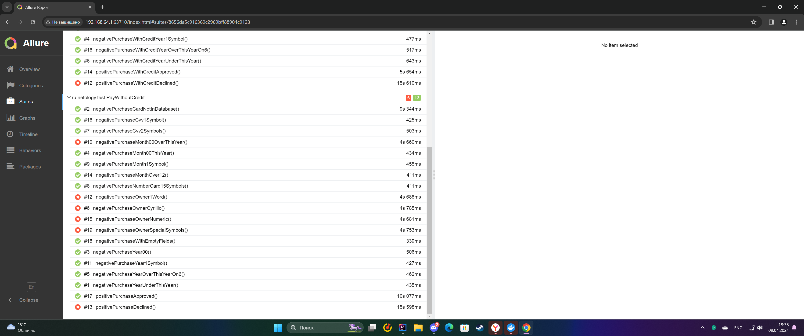
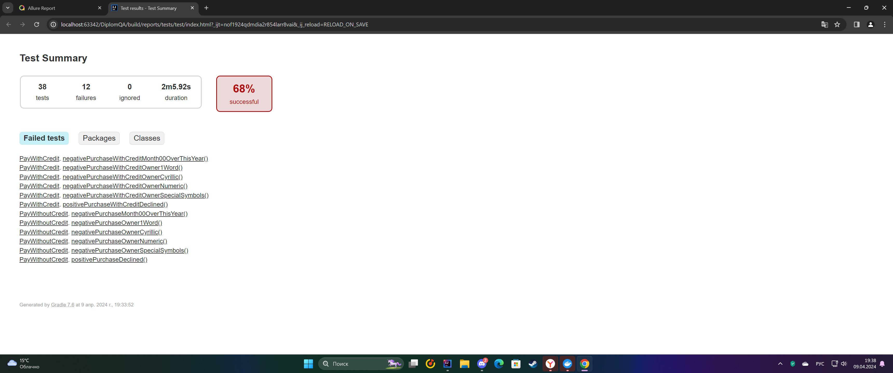

# Отчет по итогам тестирования
## Краткое описание:
Проведена работа по автоматизации тестирования веб-сервиса, который предлагает купить тур по определённой цене двумя способами:

*Обычная оплата по дебетовой карте*

*Уникальная технология: выдача кредита по данным банковской карты*

## Количество тест-кейсов:
* Всего было написано 38 тестов.
## Процент успешных и не успешных тест-кейсов:
* Успешных тестов 26 (68,42%);
* Упавших тестов 12 (31,58%).
* Отчет Allure представлен ниже:

* Отчет Gradle представлен ниже: 

## Рекомендации:
*[Устранить баги обнаруженные в ходе тестирования](https://github.com/ivangorbunov1996/Diplom/issues)*
